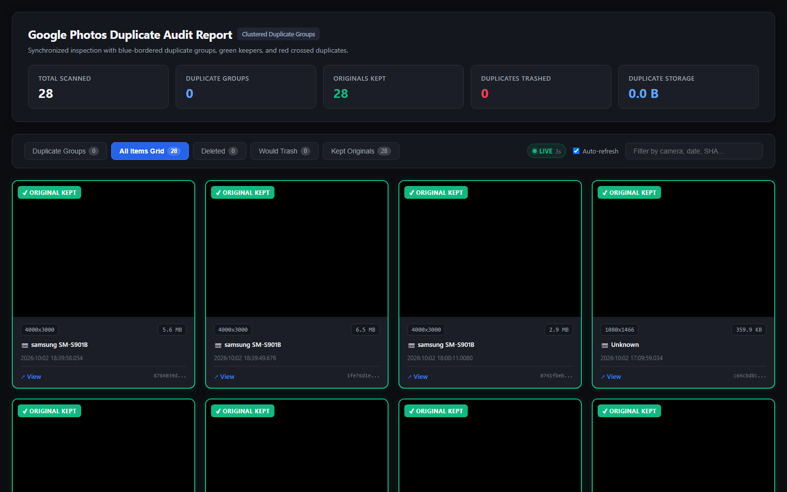
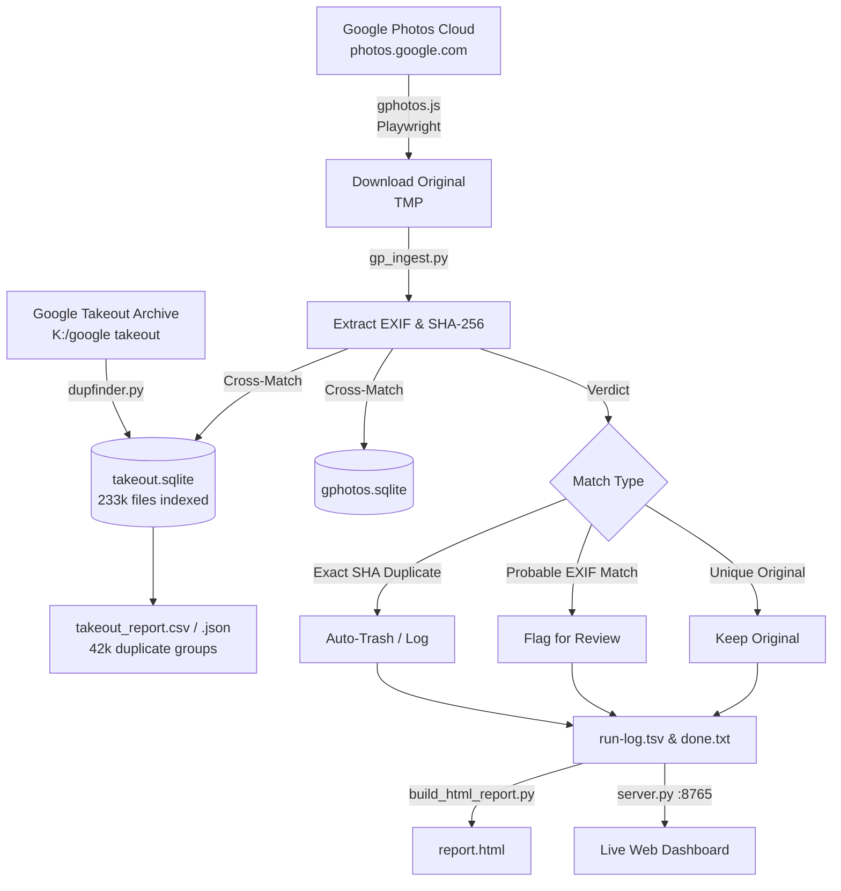

# Google Photos & Takeout Duplicate Finder & Online Cleanup Pipeline

An automated, high-precision duplicate image detection, verification, and cleanup system designed to index Google Takeout archives and live Google Photos cloud libraries.



---

## Key Features

1. **Two-Tier Detection Safety Model**:
   * **Exact Duplicate (Byte-Identical SHA-256)**: Safe for automated cleanup.
   * **Probable Duplicate (Identical Dimensions & EXIF Timestamp, Differing SHA)**: Flagged for manual review; never auto-deleted.
2. **Local Takeout Archival Scanner (`dupfinder.py`)**:
   * Multi-threaded SQLite indexing of massive local archives (tested on 233,000+ files).
   * EXIF extraction: `DateTimeOriginal` with subsecond precision, camera `Make`/`Model`, `ImageUniqueID`, and native dimensions ($W \times H$).
   * Clustered duplicate reporting in CSV, JSON, and HTML visual grids.
3. **Live Google Photos Browser Automation (`gphotos/gphotos.js`)**:
   * Puppeteer-driven browser automation (system Chrome) with persistent session authentication.
   * High-speed original file download interception and real-time EXIF/SHA-256 analysis.
   * Automated cross-referencing against both online photos and local Takeout archives.
   * Safe trashing of verified online duplicates via the native Google Photos UI.
4. **Live Visual Inspection Dashboard (`gphotos/server.py` & `report.html`)**:
   * Zero-dependency Python server running on `http://localhost:8765/`.
   * Real-time 3s auto-refresh polling with live statistics (Total Scanned, Originals Kept, Duplicates Trashed, Reclaimed Storage).
   * Visual standards:
     * **Duplicate Groups**: Encapsulated in blue-bordered containers (`2px solid #3b82f6`).
     * **Original Keeper**: 1 green card per group (`2px solid #10b981`).
     * **Duplicates**: Red cards (`2px solid #f43f5e`) overlaid with a vector red $\times$.

---

## Architecture Overview



---

## Quickstart Guide

### 1. Requirements
* Python 3.10+ (`Pillow`, `piexif`)
* Node.js 18+ & Puppeteer (`npm install`)
* Google Chrome

### 2. Install Dependencies
```bash
# In project root:
pip install pillow piexif

# In gphotos directory:
cd gphotos
npm install
```

### 3. Scan Local Takeout Directory
```bash
python dupfinder.py scan "K:\google takeout" --db takeout.sqlite --out takeout_report
```

### 4. Start the Live Dashboard
```bash
cd gphotos
python server.py --port 8765
```
Open **[http://localhost:8765/](http://localhost:8765/)** in your browser.

### 5. Run the Google Photos Inspection Pipeline
```bash
cd gphotos
# Safe Dry-Run (Logs duplicates and displays on dashboard without trashing):
node gphotos.js run --limit 100 --takeout ../takeout.sqlite

# Full Online Cleanup (Trashes verified exact duplicates in Google Photos):
node gphotos.js run --takeout ../takeout.sqlite --delete-gp-dups
```

---

## Port Conventions
* **8765**: Live Duplicate Audit Dashboard (`server.py`).
* **8080 / 8081**: Reserved for `beepet_local` Docker environments. Do NOT bind.

---

## License
MIT License. Created by Peter Albrecht.
